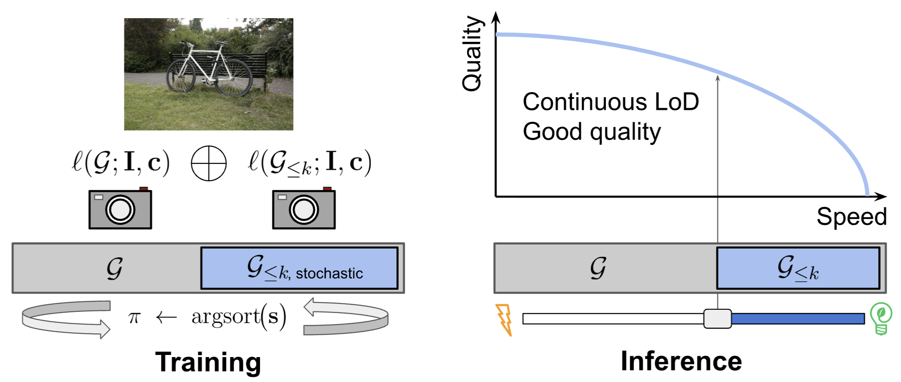

# Matryoshka Gaussian Splatting

### [Paper (arXiv)](https://arxiv.org/abs/arXiv:2603.19234) | [Supplementary](https://drive.google.com/uc?export=download&id=1b2FBIG1xXrbdXJ6KiQ9RY_UH0w6BZDum) 

**[Zhilin Guo](https://zhilinguo.github.io/), [Boqiao Zhang](https://boqiaoz00.github.io/boqiao_steven_zhang.github.io/), [Hakan Aktas](https://scholar.google.com/citations?user=RxjN5w4AAAAJ&hl=en), [Kyle Fogarty](https://kyle-fogarty.github.io/), [Jeffrey Hu](https://jefequien.github.io/), [Nursena Koprucu Aslan](https://www.cst.cam.ac.uk/people/nk618), [Wenzhao Li](https://wenzhao-cam.github.io/), [Canberk Baykal](https://johnberg1.github.io/), [Albert Miao](https://albert-miao.github.io/), [Josef Bengtson](https://www.chalmers.se/en/persons/bjosef/), [Chenliang Zhou](https://chenliang-zhou.github.io/), [Weihao Xia](https://www.cst.cam.ac.uk/people/wx258), [Cristina Nader Vasconcelos](https://research.google/people/106908/), [Cengiz Oztireli](https://sites.google.com/view/cengiz-oztireli-intro/home)**

University of Cambridge, Chalmers University of Technology, Google

> Matryoshka Gaussian Splatting (MGS) is a training framework that enables continuous level-of-detail (LoD) for 3D Gaussian Splatting without sacrificing full-capacity rendering quality. MGS learns a single ordered set of Gaussians so that rendering any prefix -- the first *k* splats -- produces a coherent reconstruction that maintains high fidelity even at reduced budgets. The method requires only two forward passes per iteration and no architectural modifications.



**Framework overview.** Matryoshka Gaussian Splatting learns an ordered set of primitives; rendering any prefix yields a coherent reconstruction with fidelity improving as the budget increases.


**Continuous LoD without sacrificing full-capacity quality.** MGS achieves the highest fidelity at every operating point compared to strongest baselines, with quality degrading gracefully under budget reduction.


---

## Folder structure

After installation and data setup the workspace root should look like this:

```
MatryoshkaGaussianSplatting/
├── matryoshka-gaussian-splatting/ 
├── benchmark/
│   ├── MipNeRF360/
│   │   └── 360_v2/<scene>/
│   ├── TandT/tandt/<scene>/
│   ├── DeepBlending/<scene>/
│   └── BungeeNeRF/<scene>/
├── checkpoint/
│   └── <benchmark>/<scene>/
│       └── ckpts/
└── prediction-image/
    └── <benchmark>/<scene>/
```

| Folder | Purpose |
|--------|---------|
| **matryoshka-gaussian-splatting/** | This repo. |
| **benchmark/** | Scene data; paths per benchmark in the table below. |
| **checkpoint/** | Created by `command/train.sh`; checkpoints in `ckpts/`. |
| **prediction-image/** | Created by `command/eval.sh`; metrics and optional images. |

## Installation

Our code is tested on Ubuntu 24.04 with an NVIDIA A100. We use CUDA 12.8 and PyTorch 2.8.0. gsplat is installed from source.

See **[INSTALL.md](INSTALL.md)** for our installation steps.

## Data Preparation

Download and organize benchmark datasets under a `benchmark/` directory at the workspace root.

| Benchmark | Scenes | Downsample | Path |
|-----------|--------|------------|------|
| MipNeRF 360 indoor | bonsai, counter, kitchen, room | 2x | `benchmark/MipNeRF360/360_v2/<scene>/` |
| MipNeRF 360 outdoor | bicycle, flowers, garden, stump, treehill | 4x | `benchmark/MipNeRF360/360_v2/<scene>/` |
| Tanks & Temples | truck, train | 1x | `benchmark/TandT/tandt/<scene>/` |
| Deep Blending | DrJohnson, Playroom | 1x | `benchmark/DeepBlending/<scene>/` |
| BungeeNeRF | amsterdam, barcelona, bilbao, chicago, hollywood, pompidou, quebec, rome | 1x | `benchmark/BungeeNeRF/<scene>/` |

Each scene directory must contain COLMAP data: `images/` and `sparse/0/` (or `sparse/`).

**Test split:** automated, every 8th image (indices 0, 8, 16, ...) for all benchmarks.

## Training

All commands are run from `matryoshka-gaussian-splatting/`. The paper configuration uses MCMC densification with 5M Gaussian capacity, 50k steps, opacity-descending ordering, and single-prefix-plus-full training objective.

The convenience script `command/train.sh` resolves data paths, downsample factors, and benchmark-specific settings automatically:

```bash
bash command/train.sh <GPU> <BENCHMARK> <SCENE>
```

**Examples:**

```bash
bash command/train.sh 0 mipnerf360 bicycle
bash command/train.sh 0 tanksandtemples truck
bash command/train.sh 0 deepblending DrJohnson
bash command/train.sh 0 bungeenerf rome
```
**First run:**  If gsplat's CUDA kernels were not pre-compiled during installation, they will be compiled on first use (often 2 to 10 minutes).

Checkpoints are saved to `../checkpoint/<BENCHMARK>/<SCENE>/ckpts/` (e.g. `../checkpoint/mipnerf360/bicycle/ckpts/`).

The script handles these automatically, but for manual usage note:
- MipNeRF 360 indoor: `--data_factor 2`; outdoor: `--data_factor 4`.
- Tanks & Temples / Deep Blending / BungeeNeRF: `--data_factor 1`.
- Deep Blending: `--strategy.refine_stop_iter 25000`.

## Evaluation

Evaluate a trained checkpoint at multiple Gaussian budget ratios, reporting PSNR, SSIM, LPIPS, and FPS:

```bash
bash command/eval.sh <GPU> <BENCHMARK> <SCENE>
```

**Examples:**

```bash
bash command/eval.sh 0 mipnerf360 bicycle
bash command/eval.sh 0 tanksandtemples truck
bash command/eval.sh 0 deepblending DrJohnson
bash command/eval.sh 0 bungeenerf rome
```

The script expects the checkpoint at `../checkpoint/<BENCHMARK>/<SCENE>/ckpts/ckpt_49999_rank0.pt` and writes results to `../prediction-image/<BENCHMARK>/<SCENE>/`.

Custom operating points can be specified:

```bash
python eval.py --ckpt ... --data_dir ... --output_dir ... \
    --ratios 1.0 0.5 0.25 0.1 0.05
```

By default, evaluation runs at the 12 paper operating points: 100%, 90%, 80%, 70%, 60%, 50%, 40%, 30%, 20%, 10%, 5%, 1% of full Gaussian count.

**FPS protocol:** each frame is timed with `torch.cuda.synchronize()`; the first 3 frames are excluded to avoid warmup effects.

## Evaluation Protocol Details

- **Metrics:** PSNR, SSIM, LPIPS (AlexNet, normalized) at each operating point.
- **Operating points:** prefix ratios {1%, 5%, 10%, 20%, 30%, 40%, 50%, 60%, 70%, 80%, 90%, 100%} of total Gaussian count.
- **Ordering:** Gaussians sorted by descending opacity at inference time; rendering the top-*k* prefix.
- **FPS:** per-frame wall-clock time with explicit CUDA synchronization, excluding first 3 frames.

## Citation

```bibtex
@article{guo2026matryoshkagaussiansplatting,
      title={Matryoshka Gaussian Splatting},
      author={Guo, Zhilin and Zhang, Boqiao and Aktas, Hakan and Fogarty, Kyle and Hu, Jeffrey and Aslan, Nursena Koprucu and Li, Wenzhao and Baykal, Canberk and Miao, Albert and Bengtson, Josef and Zhou, Chenliang and Xia, Weihao and Nader Vasconcelos, Cristina and Oztireli, Cengiz},
      journal={arXiv preprint arXiv:2603.19234},
      year={2026}
}
```

## License

This project is licensed under the [Apache License 2.0](LICENSE).

## Acknowledgements

- [gsplat](https://github.com/nerfstudio-project/gsplat) -- differentiable Gaussian rasterization library.
- [3DGS-MCMC](https://github.com/ubc-vision/3dgs-mcmc) -- MCMC densification strategy.
- [3D Gaussian Splatting](https://github.com/graphdeco-inria/gaussian-splatting) -- foundational 3DGS work.

This work was supported by a UKRI Future Leaders Fellowship [grant number G127262].
